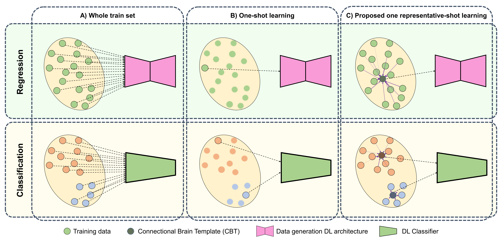

# One Representative-shot Learning 
Please contact guvercin16@itu.edu.tr for inquiries. Thanks. 



# Introduction

> **One Representative-shot Learning with CBT**
>
> Umut Güvercin and Islem Rekik
>
> BASIRA Lab, Faculty of Computer and Informatics, Istanbul Technical University, Istanbul, Turkey
>
> **Abstract:** *Connectional brain templates (CBTs) are the normalized versions of the populations of brain networks. A CBT captures the discriminative and representative features of the graph-represented brain populations. Therefore, a brain network population can be mapped to a CBT, a representative sample, that will be used to represent the brain network population during the training process of the deep learning method. In this paper, we propose a One Representative-shot Learning with CBT method, a method that uses CBT as representative sample of the population while discarding the original training population. We study our one-shot learning strategy with two different learning tasks to consolidate its generalizability. Selected time-series dynamic graph evolution prediction model is trained with a CBT sample that is created by CBTs of each timepoint, while selected graph classification prediction model is trained with a CBT sample from each class. We demonstrate that our method significantly outperformed selected one-shot learning comparison methods in both tasks while competing with the conventional training strategy.*


## Code
This code was implemented using Python 3.8 (Anaconda) on Linux.

## Installation
### *Anaconda Installation*
* Go to  https://www.anaconda.com/products/individual
* Download version for your system (We used Python 3.8  on 64bit Linux)
* Install the platform
* Create a conda environment by typing:  ```conda create --name CBT-Training pip python=3.8```

### *Dependency Installation*
Copy and paste following commands to install all packages
```sh
$ conda activate CBT-Training
$ conda install pytorch==1.6.0 torchvision==0.7.0 cudatoolkit=10.1 -c pytorch
$ pip install scikit-learn==0.23.1
$ pip install torch-geometric==1.6.1
$ pip install torch-sparse==0.6.7 -f https://pytorch-geometric.com/whl/torch-1.6.0+cu101.html
$ pip install torch-scatter==2.0.5 -f https://pytorch-geometric.com/whl/torch-1.6.0+cu101.html
$ pip install seaborn
```
This is all for Cuda 10.1 installation, please visit (optional) PyTorch-Geometric’s web page (https://pytorch-geometric.readthedocs.io/en/latest/notes/installation.html) for description on installing CPU or other CUDA versions.
## Data format
In case you want to use One Representative-shot Learning with CBT in your dataset, we represent brain graphs differently for time-series prediction and graph classification learning tasks. 
Time-series prediction task takes the brain graphs in shape [#Subjects, #Nodes, #Nodes]. Graph classification task takes the brain graphs in shape [#Subjects, #Nodes, #Nodes, #Views].
The simulated data uses only one view for graph classification. 

## Run One Representative-shot Learning with CBT
To simulate brain data, you can run the create_data.py code under "data" directory. It will create 113 random samples for prediction task and 100 samples for classification task.
```sh
$ python create_data.py
```

After creating the simulated data you can run one of the following to observe the mean absolute error for prediction or accuracy for classification.
```sh
$ python Classification.py
$ python TimeSeriesPrediction.py
```

## Relevant Repositories
* [Deep Graph Normalizer](https://github.com/basiralab/DGN)
* [EvoGraphNet](https://github.com/basiralab/EvoGraphNet)

